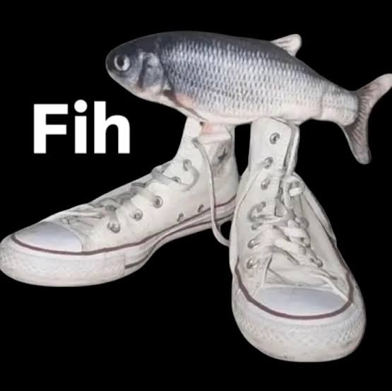

Yo, my name is Francisco Castro.  
I'm a second year masters student trying to get by  
I'm balancing on the line of keeping stuff together and crashing out  

## R Tutorials:
### [Assignment 1](R_tutorial1.html)

  

  
  
  

  

  
  

